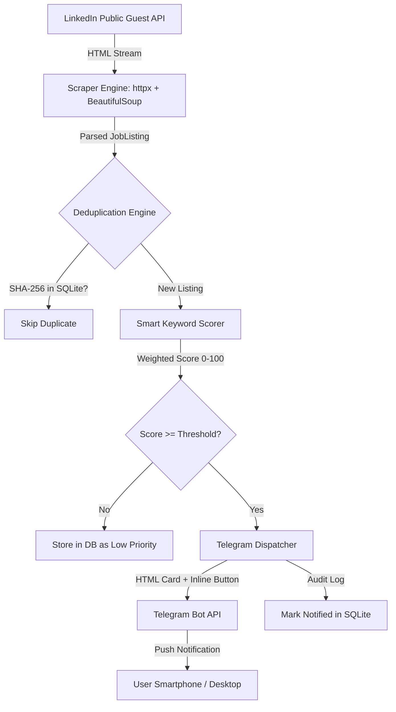

# 🛰️ Cloud Job Sentinel: LinkedIn Ingestion & Real-Time Alert Engine

[](https://www.python.org/)
[](https://opensource.org/licenses/MIT)
[](https://github.com/psf/black)
[](https://docs.pytest.org/)

> **Autonomous, event-driven ingestion engine that continuously scrapes LinkedIn for Cloud, DevOps, and Backend internships, computes deterministic SHA-256 deduplication signatures, scores listings with a weighted heuristic algorithm, and dispatches real-time alerts to Telegram with interactive "Apply Now" buttons.**

---

## 📑 Table of Contents
- [Executive Overview](#-executive-overview)
- [System Architecture](#-system-architecture)
- [Key Engineering Pillars](#-key-engineering-pillars)
- [Project Directory Layout](#-project-directory-layout)
- [Quick Start Guide](#-quick-start-guide)
- [CLI Command Reference](#-cli-command-reference)
- [24/7 Cloud Deployment (GitHub Actions)](#-247-cloud-deployment-github-actions)
- [Technical Interview Talking Points](#-technical-interview-talking-points)

---

## 💡 Executive Overview

Applying to competitive internships within the first 1-2 hours of posting drastically increases callback rates. However, manually refreshing job boards leads to burnout and missed opportunities.

**Cloud Job Sentinel** solves this problem by functioning as a lightweight 24/7 daemon:
1. **Scrapes** real-time job listings from public LinkedIn guest endpoints at sub-second speeds without requiring user login credentials or risking account bans.
2. **Deduplicates** listings using deterministic SHA-256 fingerprint hashing in an indexed SQLite database, guaranteeing zero duplicate alerts.
3. **Scores** listings using a multi-factor weighting algorithm that boosts entry-level/intern keywords while aggressively penalizing senior/staff roles.
4. **Dispatches** structured HTML alert cards with inline application buttons directly to Telegram.

---

## 🏛️ System Architecture



---

## ⚙️ Key Engineering Pillars

### 1. High-Speed Guest Ingestion Engine (`core/scraper.py`)
* Leverages LinkedIn's public guest search endpoint (`/jobs-guest/jobs/api/seeMoreJobPostings/search`).
* Eliminates browser automation overhead (10x faster and uses <50MB RAM compared to Playwright/Selenium).
* Rotates realistic browser User-Agents and introduces randomized human jitter (1.5s - 3.5s) to avoid HTTP 429 rate-limiting.
* Sanitizes and strips referral tracking tokens (`?refId=...`) to produce clean canonical URLs (`https://www.linkedin.com/jobs/view/<job_id>`).

### 2. Deterministic SHA-256 Fingerprinting (`core/database.py`)
* Fingerprints each job based on `company::title::location` using SHA-256 hashing.
* Handles job re-postings and URL redirects seamlessly.
* Indexed SQLite schema (`hash_id` primary key, `detected_at` index, `notified` status) enables microsecond lookup times.

### 3. Smart Keyword Scoring Algorithm (`core/scorer.py`)
* **Role Level Boosts (+25 to +40)**: `intern`, `internship`, `co-op`, `junior`, `trainee`, `graduate`.
* **Technical Skills (+15 to +20)**: `cloud`, `aws`, `azure`, `devops`, `sre`, `docker`, `kubernetes`, `terraform`, `python`.
* **Seniority Penalties (-40 to -90)**: Disqualifies roles with `senior`, `principal`, `staff`, `lead`, `architect`, `10+ years`, or `phd required`.
* Generates priority badges: `🔥 HIGH` (≥75%), `⚡ MEDIUM` (≥50%), or `LOW`.

### 4. Interactive Telegram Dispatcher (`dispatchers/telegram.py`)
* Uses Telegram Bot API to deliver formatted HTML cards.
* Embeds direct **"🚀 Apply on LinkedIn"** inline keyboard buttons.
* Graceful local fallback: renders high-fidelity colored terminal panels via `rich` when running in `--dry-run` mode.

---

## 📂 Project Directory Layout

```text
Project 2 (linkedin)/
├── config/
│   ├── __init__.py
│   └── settings.py          # Typed Pydantic Settings & env validation
├── core/
│   ├── __init__.py
│   ├── database.py          # SQLite schema, indexing & deduplication
│   ├── models.py            # Pydantic JobListing & MatchResult schemas
│   ├── scorer.py            # Multi-tier keyword scoring engine
│   └── scraper.py           # Async LinkedIn guest HTML scraper
├── dispatchers/
│   ├── __init__.py
│   └── telegram.py          # Telegram Bot API client & rich console fallback
├── handlers/
│   ├── __init__.py
│   └── pipeline.py          # Orchestration pipeline & execution telemetry
├── logs/                    # Rotating log files (git-ignored)
├── tests/
│   ├── conftest.py          # Pytest fixtures & mock job listings
│   ├── test_database.py     # SQLite persistence & deduplication tests
│   ├── test_pipeline.py     # End-to-end integration tests
│   ├── test_scorer.py       # Heuristic scoring & penalty tests
│   ├── test_scraper.py      # HTML parsing & URL cleaning tests
│   └── test_telegram.py     # HTML payload & dry-run tests
├── .github/workflows/
│   └── sentinel_cron.yml    # CI test matrix & 24/7 scheduled cloud runner
├── .env.example             # Configuration template
├── main.py                  # CLI entrypoint with switches
├── pytest.ini               # Test configuration
├── requirements.txt         # Production dependencies
└── README.md
```

---

## 🚀 Quick Start Guide

### 1. Prerequisites
* Python 3.11+
* (Optional) Telegram account with Bot Token from [@BotFather](https://t.me/botfather)

### 2. Installation
```bash
# Clone the repository
git clone https://github.com/<your-username>/cloud-job-sentinel.git
cd cloud-job-sentinel

# Install dependencies
pip install -r requirements.txt
```

### 3. Configure Environment
Copy `.env.example` to `.env`:
```bash
cp .env.example .env
```
Edit `.env` to configure your search preferences and optional Telegram credentials:
```env
TELEGRAM_BOT_TOKEN="123456789:ABCdefGhIJKlmNoPQRsTUVwxyZ"
TELEGRAM_CHAT_ID="987654321"
SEARCH_KEYWORDS="Cloud Engineer Intern, DevOps Intern, Site Reliability Intern, Python Backend Intern"
SEARCH_LOCATIONS="Remote, India, United States"
MIN_MATCH_SCORE=40
DRY_RUN=true
```

### 4. Run the Test Suite
```bash
pytest -v
```

---

## 💻 CLI Command Reference

```bash
# 1. Run a dry-run test scan (inspect alerts directly in terminal)
python main.py --keyword "Cloud Intern" --location "Remote" --limit 5 --dry-run

# 2. View current database statistics (seen jobs, notified count, avg score)
python main.py --stats

# 3. Verify Telegram bot connection with a test ping
python main.py --test-telegram

# 4. Trigger active Telegram notifications
python main.py --send-telegram

# 5. Run continuous monitoring daemon (checks every 60 minutes)
python main.py --daemon --interval 3600
```

---

## ☁️ 24/7 Cloud Deployment (GitHub Actions)

Cloud Job Sentinel can run continuously in the cloud for free using GitHub Actions Cron:

1. Push your repository to GitHub.
2. Go to **Settings > Secrets and variables > Actions** in your GitHub repository.
3. Add two Repository Secrets:
   * `TELEGRAM_BOT_TOKEN`
   * `TELEGRAM_CHAT_ID`
4. The workflow in `.github/workflows/sentinel_cron.yml` will automatically execute every 6 hours and push new matching jobs directly to your phone.
5. You can also trigger a run manually at any time via the **Actions > Run workflow** button.

---

## 🎤 Technical Interview Talking Points

| Question | Strong Architecture Answer |
| :--- | :--- |
| **Why not use Playwright for everything?** | *"Heavy browser engines require 300MB+ RAM per instance and slow down execution. For public job boards, using async HTTP with rotating headers gives sub-second responses and runs effortlessly inside GitHub Actions or serverless containers."* |
| **How do you avoid alerting the same job twice?** | *"We compute deterministic SHA-256 fingerprints across `company::title::location` and store them in an indexed SQLite database with `INSERT OR IGNORE`. This catches duplicate postings even if the employer regenerates job URLs."* |
| **How do you filter senior positions that appear in intern searches?** | *"The scoring engine uses positive heuristics for junior indicators and applies heavy negative penalties (-60 to -90) for disqualifiers like 'Senior', 'Lead', 'Staff', or '10+ years', dropping their aggregate score below the notification threshold."* |

---

## 📜 License
Distributed under the MIT License. See `LICENSE` for details.
